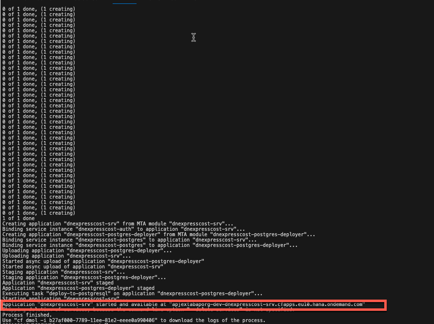

## Prerequisites:
1. You’ve installed [Node.js](https://nodejs.org/en/download/). Make sure you run the latest long-term support (LTS) version of Node.js with an even number like 18. Refrain from using odd versions, for which some modules with native parts will have no support and thus might even fail to install. In case of problems, see the Troubleshooting guide for CAP.
2. You’ve installed the latest version of [Visual Studio Code](https://code.visualstudio.com/) (VS Code).
3. You’ve downloaded and installed the [cf command line client](https://github.com/cloudfoundry/cli#downloads) for Cloud Foundry as described in the tutorial Install the [Cloud Foundry Command Line Interface (CLI)](https://developers.sap.com/tutorials/cp-cf-download-cli.html).
4. You’ve downloaded and installed the [MBT Built Tool](https://sap.github.io/cloud-mta-build-tool/download/).
5. You’ve downloaded and installed the [MultiApps CF CLI plugin](https://github.com/cloudfoundry/multiapps-cli-plugin/blob/master/README.md).
6. If you don’t have a Cloud Foundry Trial subaccount and dev space on [SAP BTP](https://cockpit.hanatrial.ondemand.com/cockpit/) yet, create your [Cloud Foundry Trial Account](https://developers.sap.com/tutorials/hcp-create-trial-account.html) with US East (VA) as region and, if necessary [Manage Entitlements](https://developers.sap.com/tutorials/cp-trial-entitlements.html).
7.  You BTP subaccount has been entitled with service [PostgreSQL](https://discovery-center.cloud.sap/serviceCatalog/postgresql-hyperscaler-option?region=all) with plan free.
8. You have installed [postman](https://www.postman.com/downloads)


### Step 1: Create a CAP Project with the following commands and open it in Visual Studio:

    cds init dnexpresscost
    code dnexpresscost


### Step 2:  create file schema.cds under folder db and past the following code in it:


```nodejs
namespace com.dnexpresscost;

entity ExpressPrice  {
    key tag: String;
    ID: Integer;
    originProvince: String;
    targetProvince: String;
    basePrice: Decimal(9,2);
    scalePrice: Decimal(9,2);
}

entity DNExpress  {
    key outboundDelivery: String;
    originProvince: String;
    targetProvince: String;
    basePrice: Decimal(9,2);
    scalePrice: Decimal(9,2);
    grossWeight: Decimal(9, 2);
    expressCost: Decimal(9,2);
    cpCode: String;
    logisticCode: String;
    logisticTrace:String(800);

}
```

### Step 3:  create folder data under folder db and create a file named com.dnexpresscost-ExpressPrice.csv under folder data.

### Step 4:  create file cat-service.cds under folder srv with the following code:
```
using com.dnexpresscost as my from '../db/schema';

service CatalogService @(requires: 'authenticated-user') {
    entity   ExpressPrice as projection on my.ExpressPrice;
    entity  DNExpress as projection on my.DNExpress;
    action  updateExpress ( outboundDelivery: DNExpress:outboundDelivery,cpCode: DNExpress:cpCode,logisticCode: DNExpress:logisticCode,logisticTrace: DNExpress:logisticTrace  ) returns { logisticCode: String };
    action  insertExpress ( outboundDelivery: DNExpress:outboundDelivery, originProvince: DNExpress: originProvince,targetProvince: DNExpress:targetProvince,grossWeight: String ) returns {  expressCostStr: String };
}
```
### Step 5:  create file cat-service.js under folder srv with the following code:
```
const cds = require('@sap/cds');
const { COMMIT } = require('@sap/cds/libx/_runtime/db/utils/coloredTxCommands');


class CatalogService extends cds.ApplicationService {init(){
  

  const { ExpressPrice,DNExpress  } = cds.entities ('com.expressprice');

  this.on ('insertExpress', async req => {
    const {outboundDelivery,originProvince,targetProvince,grossWeight} = req.data; 
    let tag = originProvince+targetProvince;
    console.log(tag);
    // let {basePrice,scalePrice } = await SELECT  `basePrice,scalePrice` .from  `ExpressPrice` .where `tag='${tag}'`;

     let {basePrice,scalePrice } = await SELECT `basePrice,scalePrice` .from  (ExpressPrice,tag);
    
     let expressCost = 0;
    
    if(Number(grossWeight)  < 1){
      expressCost = Number(basePrice);
    }else{
      expressCost =  Number(basePrice) + ( Number(grossWeight) - 1) *  Number(scalePrice);
    }
    let expressCostStr = String(expressCost);
    const dnExpress = {outboundDelivery:outboundDelivery,originProvince:originProvince,targetProvince:targetProvince,basePrice: basePrice,scalePrice:scalePrice,grossWeight: Number(grossWeight),expressCost:expressCost };
    await INSERT (dnExpress) .into (DNExpress);
    await COMMIT;
    // await INSERT (DNExpress,outboundDelivery) .with ({ outboundDelivery: outboundDelivery,originProvince:originProvince,targetProvince:targetProvince,basePrice:basePrice,scalePrice:scalePrice,grossWeight:grossWeight,expressCost:expressCost});
    console.log(expressCostStr);
    return { expressCostStr };
  });
  this.on ('updateExpress', async req => {
    const {outboundDelivery,cpCode,logisticCode, logisticTrace} = req.data; 
    let dn = await SELECT `outboundDelivery` .from (DNExpress,outboundDelivery);
    if(!dn) return req.error(404,`DN ${outboundDelivery} does not exist`)
    await UPDATE (DNExpress,outboundDelivery) .with ({ cpCode: cpCode,logisticCode:logisticCode,logisticTrace:logisticTrace });
  await COMMIT;
  return {logisticCode};
  });


  return super.init();
}}

module.exports = { CatalogService };
```
### Step 6:  run the following command at the path dnexpresscost

    cds compile srv --to xsuaa > xs-security.json
    cds add xsuaa
    cds add postgres
### Step 7:  add the following json under cds require.
          "db": {
        "kind": "postgres",
        "impl": "@cap-js/postgres"
      }


### Step 8:  run the following command at the path dnexpresscost
    cds add mta


### Step 9:  run the following command at the path dnexpresscost
mkdir -p pg/srv
cds compile '*' > pg/srv/csn.json
cp -r db/data pg/srv 

### Step 9:  change path from gen/pg to pg  and change service postgresql-db's service-plan to free in the file mta.yaml

### Step 10:  add file package.json under folder pg with the following code:

```
{
  "engines": {
    "node": "^18"
  },
  "dependencies": {
    "@sap/cds": "*",
    "@cap-js/postgres": "^1.0.1"
  },
  "scripts": {
    "start": "cds-deploy"
  }
}
```

### Step 11:  run the following command at the path dnexpresscost
  mbt build


### Step 12:  run the following command at the path dnexpresscost

cf login
cf deploy mta_archives/dnexpresscost_1.0.0.mtar



### Step 13:  check the deployed application in BTP subaccount dev space .


### Step 14:  test with postman:


